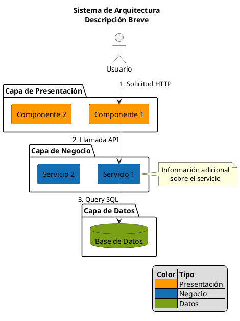
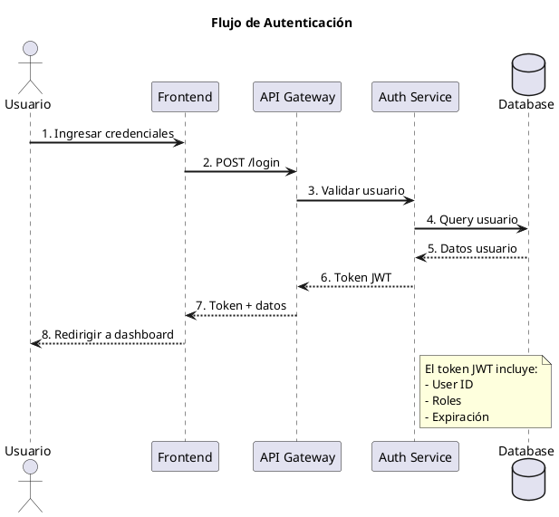
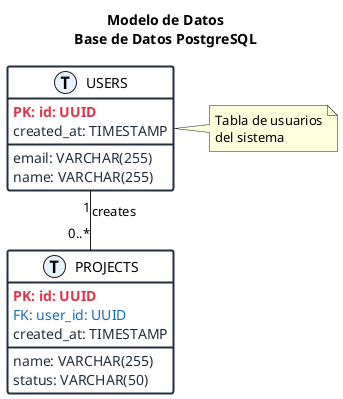
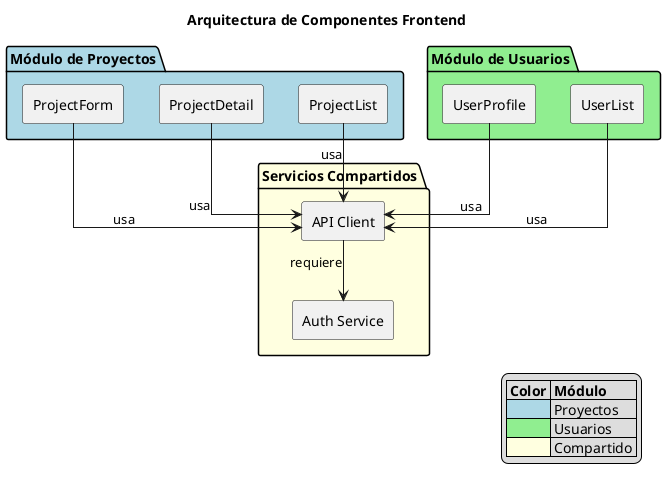

# PlantUML Diagram Best Practices

Este documento define las mejores prácticas para crear diagramas profesionales y organizados con PlantUML.

## Principios Generales

### 1. Claridad sobre Complejidad

- Mantén los diagramas simples y enfocados
- Un diagrama = Un concepto principal
- Si es muy complejo, divídelo en múltiples diagramas

### 2. Consistencia Visual

- Usa el mismo esquema de colores en todos los diagramas
- Mantén el mismo estilo de flechas y líneas
- Usa la misma nomenclatura

### 3. Jerarquía Visual

- Usa colores para agrupar elementos relacionados
- Usa tamaños de fuente para indicar importancia
- Usa grosor de líneas para indicar flujo principal

## Esquema de Colores AWS

```plantuml
!define AWS_ORANGE #FF9900  ' Content Delivery, Monitoring
!define AWS_BLUE #146EB4    ' API, Database
!define AWS_GREEN #7AA116   ' Compute (Lambda)
!define AWS_RED #DD344C     ' Security Services
!define AWS_DARK #232F3E    ' Text, Borders
```

## Configuración Base Recomendada


## Estructura de Diagramas de Arquitectura

### Template Básico



## Diagramas de Secuencia

### Template Profesional



## Diagramas de Base de Datos (ERD)

### Template con Estilo



## Diagramas de Componentes

### Organización por Módulos



## Mejores Prácticas Específicas

### 1. Uso de Colores

✅ **Bueno:**

```plantuml
rectangle "API Gateway" as api #146EB4
rectangle "Lambda Function" as lambda #7AA116
```

❌ **Malo:**

```plantuml
rectangle "API Gateway" as api #FF00FF
rectangle "Lambda Function" as lambda #00FFFF
```

### 2. Etiquetas en Conexiones

✅ **Bueno:**

```plantuml
user -> api : 1. POST /login\n(email, password)
api -> lambda : 2. Invoke function
```

❌ **Malo:**

```plantuml
user -> api
api -> lambda
```

### 3. Notas Explicativas

✅ **Bueno:**

```plantuml
note right of component #FEFECE
  <b>Configuración:</b>
  • Timeout: 30s
  • Memory: 512MB
  • Runtime: Node.js 24
end note
```

❌ **Malo:**

```plantuml
note right of component
  timeout 30s memory 512MB nodejs24
end note
```

### 4. Leyendas

✅ **Bueno:**

```plantuml
legend right
  <b>Leyenda</b>
  |= Color |= Tipo de Servicio |
  |<#FF9900> | CDN y Monitoreo |
  |<#146EB4> | API y Base de Datos |
  |<#7AA116> | Compute (Lambda) |

  <b>Notas:</b>
  • Todos los servicios en AWS
  • Arquitectura serverless
  • Auto-escalado habilitado
endlegend
```

### 5. Títulos Descriptivos

✅ **Bueno:**

```plantuml
title AWS Architecture - Project Cost Control System\nServerless Architecture with Auto-Scaling
```

❌ **Malo:**

```plantuml
title Architecture
```

## Organización de Archivos

```
docs/diagrams/
├── README.md                          # Índice de todos los diagramas
├── DIAGRAM_BEST_PRACTICES.md         # Este archivo
├── architecture/
│   ├── README.md                      # Descripción de diagramas de arquitectura
│   ├── 01-aws-infrastructure.puml     # Infraestructura AWS
│   ├── 02-frontend-components.puml    # Componentes frontend
│   └── 03-use-cases.puml             # Casos de uso
├── data-model/
│   ├── README.md
│   ├── 01-database-schema.puml        # Esquema de base de datos
│   └── 02-data-pipeline.puml         # Pipeline de datos
├── flows/
│   ├── README.md
│   ├── 01-authentication.puml         # Flujo de autenticación
│   ├── 02-project-creation.puml       # Flujo de creación de proyecto
│   └── 03-time-entry.puml            # Flujo de entrada de tiempo
└── deployment/
    ├── README.md
    └── 01-deployment-process.puml     # Proceso de deployment
```

## Generación de Imágenes

### Usando PlantUML CLI

```bash
# Instalar PlantUML
brew install plantuml  # macOS
apt-get install plantuml  # Linux

# Generar PNG
plantuml diagram.puml

# Generar SVG (mejor calidad)
plantuml -tsvg diagram.puml

# Generar todos los diagramas en un directorio
plantuml "docs/diagrams/**/*.puml"
```

### Usando VS Code

1. Instalar extensión "PlantUML"
2. Abrir archivo .puml
3. Presionar `Alt+D` para preview
4. Click derecho > "Export Current Diagram"

## Checklist de Calidad

Antes de considerar un diagrama como "terminado", verifica:

- [ ] Tiene un título descriptivo
- [ ] Usa colores consistentes con el esquema definido
- [ ] Las conexiones tienen etiquetas claras
- [ ] Incluye notas explicativas donde sea necesario
- [ ] Tiene una leyenda si usa múltiples colores
- [ ] El flujo de lectura es claro (generalmente top-down o left-right)
- [ ] No está sobrecargado (máximo 15-20 elementos)
- [ ] Los nombres son descriptivos y consistentes
- [ ] Se puede entender sin contexto adicional
- [ ] La imagen generada es legible en tamaño normal

## Recursos Adicionales

- [PlantUML Official Documentation](https://plantuml.com/)
- [PlantUML Cheat Sheet](https://plantuml.com/guide)
- [AWS Architecture Icons](https://aws.amazon.com/architecture/icons/)
- [C4 Model for Software Architecture](https://c4model.com/)

## Ejemplos de Referencia

Todos los diagramas en este proyecto siguen estas prácticas. Revisa:

- `docs/diagrams/architecture/01-aws-infrastructure.puml` - Arquitectura AWS completa
- `docs/diagrams/flows/01-authentication.puml` - Diagrama de secuencia
- `docs/diagrams/data-model/01-database-schema.puml` - ERD de base de datos
