# Project Diagrams

This directory contains all PlantUML diagrams for the Project Cost Control System.

## 📁 Directory Structure

```
diagrams/
├── architecture/          # System architecture and components
│   ├── 01-aws-infrastructure.puml
│   ├── 02-frontend-components.puml
│   └── 03-use-cases.puml
├── data-model/           # Database and data flow
│   ├── 01-database-schema.puml
│   └── 02-data-pipeline.puml
├── flows/                # User and system flows
│   ├── 01-authentication.puml
│   ├── 02-project-creation.puml
│   └── 03-time-entry.puml
└── deployment/           # Deployment and infrastructure
    └── 01-deployment-process.puml
```

## 🎨 Diagram Overview

### Architecture Diagrams

#### 1. AWS Infrastructure


Complete serverless architecture showing:

- CloudFront + S3 for frontend
- API Gateway + Lambda for backend
- Aurora Serverless v2 for database
- Cognito for authentication
- Supporting services (Secrets Manager, CloudWatch)

#### 2. Frontend Components

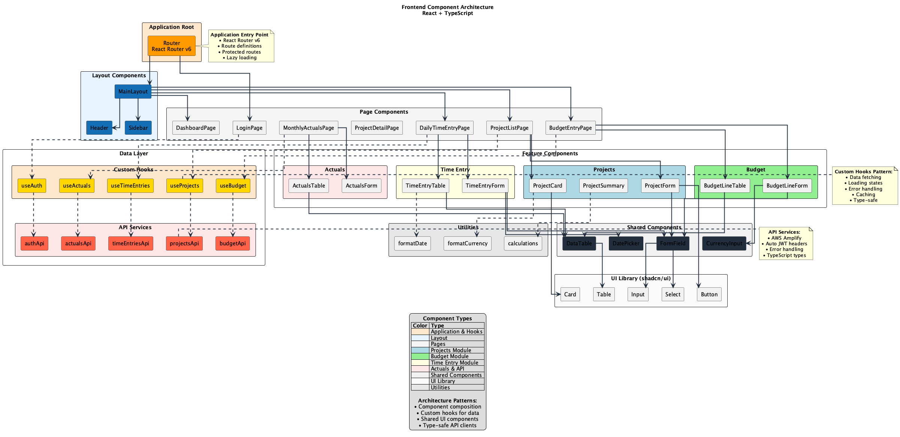

React + TypeScript component architecture:

- Application structure
- Component hierarchy
- Custom hooks
- API services
- Shared utilities

#### 3. Use Cases

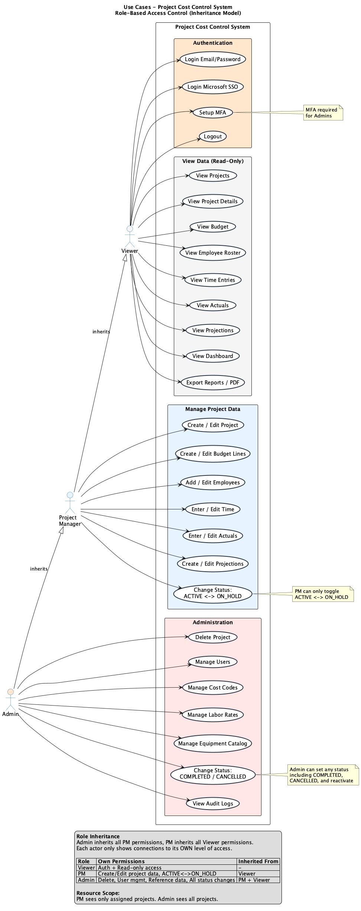

#### 4. Backend Service Layers

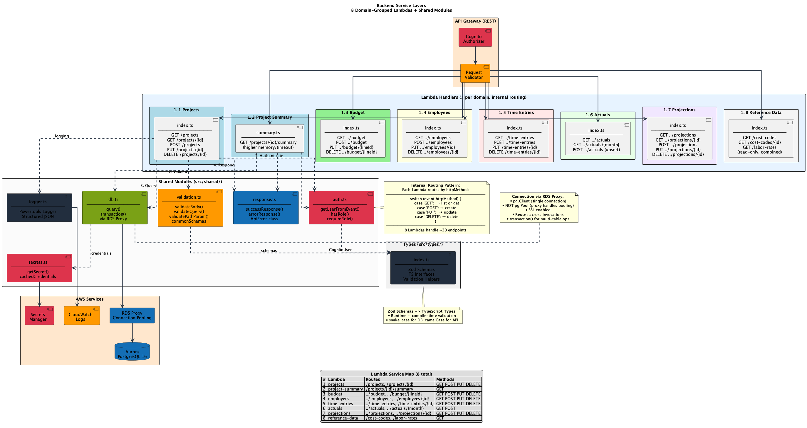

Backend service layer architecture:

- Lambda handlers organized by domain
- Shared modules (auth, db, validation, response, logger)
- Request flow pattern for every handler
- Connection to AWS Services (Aurora, Secrets Manager, CloudWatch)

#### 5. Authorization Matrix

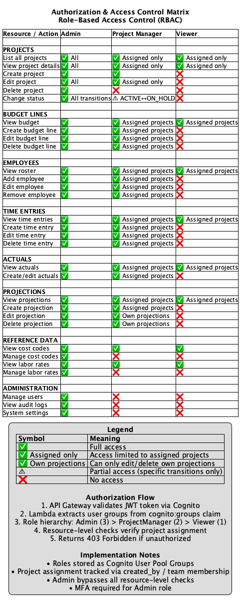

Complete RBAC authorization matrix:

- Permission grid for all resources and actions
- Admin, Project Manager, and Viewer roles
- Resource-level access rules (assigned projects only)
- Implementation notes for Cognito groups

#### 6. Frontend Routes & Screens

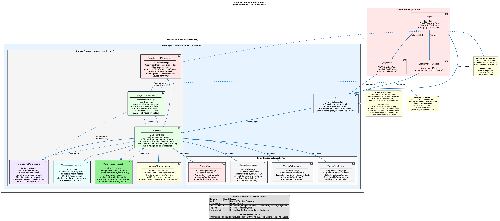

Complete screen map for all 15 MVP screens:

- Route paths and page components
- Screen content and features per page
- Navigation flows (auth, project context, setup)
- Data flow between screens
- Role guards and route protection
- OT auto-calculation rules and actuals sync logic

Role-based access control:

- Admin capabilities
- Project Manager permissions
- Viewer access
- Feature modules

### Data Model Diagrams

#### 1. Database Schema

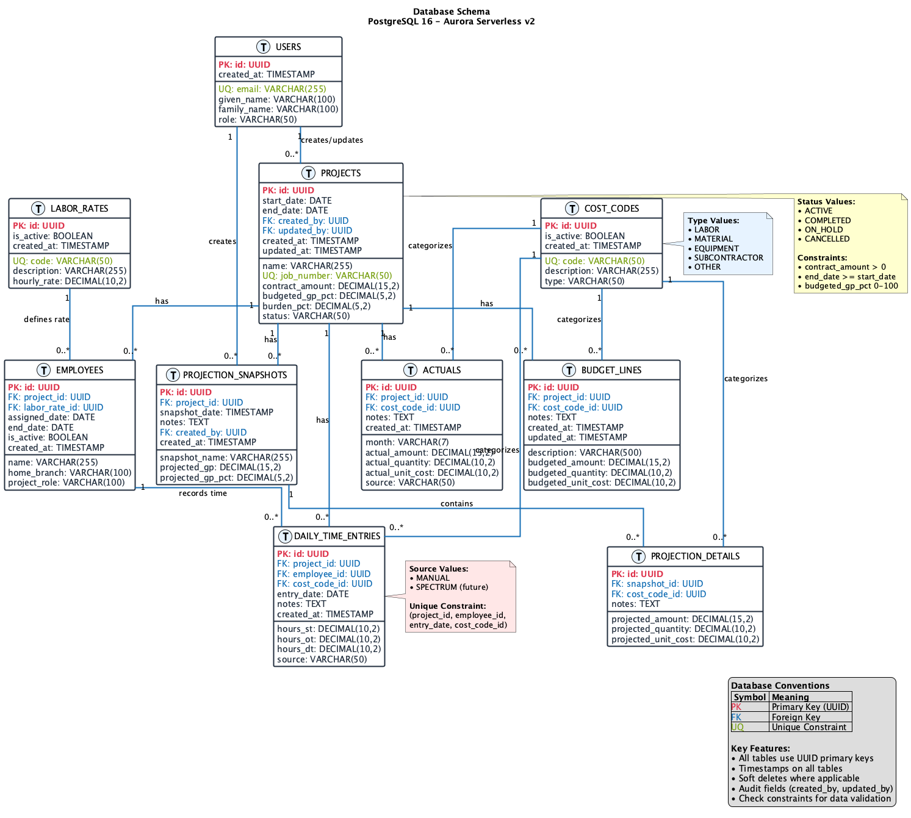

PostgreSQL database design:

- All tables and relationships
- Primary and foreign keys
- Data types and constraints
- Indexes and unique constraints

#### 2. Data Pipeline

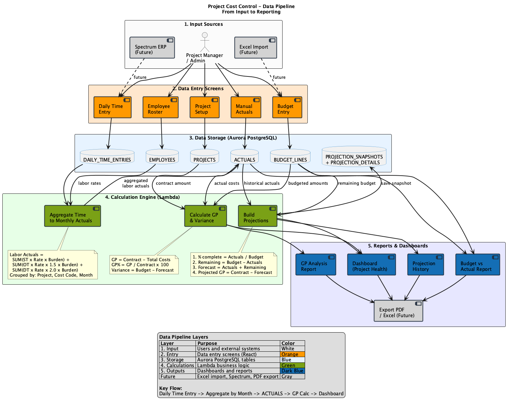

Complete data flow:

- Input sources
- Data entry points
- Storage layer
- Calculations
- Reporting outputs

### Flow Diagrams

#### 1. Authentication Flow

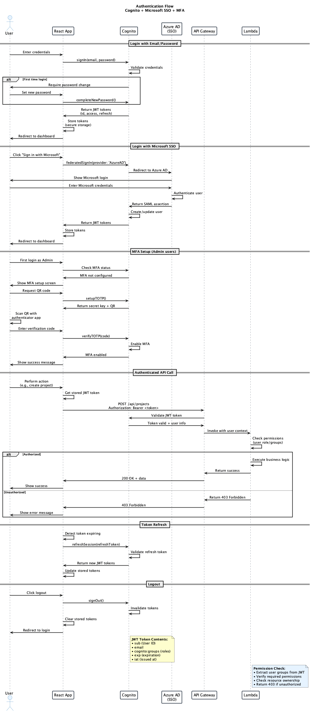

Complete authentication process:

- Email/Password login
- Microsoft SSO integration
- MFA setup and verification
- Token management
- API authorization

#### 2. Project Creation Flow

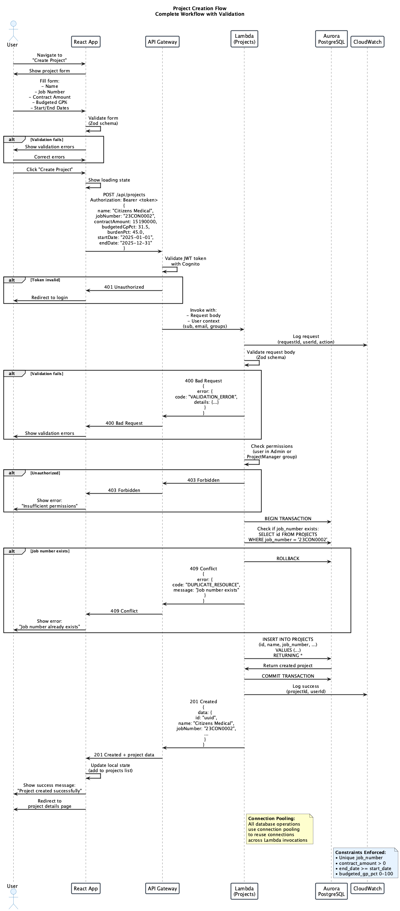

End-to-end project creation:

- Form validation
- Permission checks
- Database transactions
- Error handling
- Success flow

#### 3. Daily Time Entry Flow

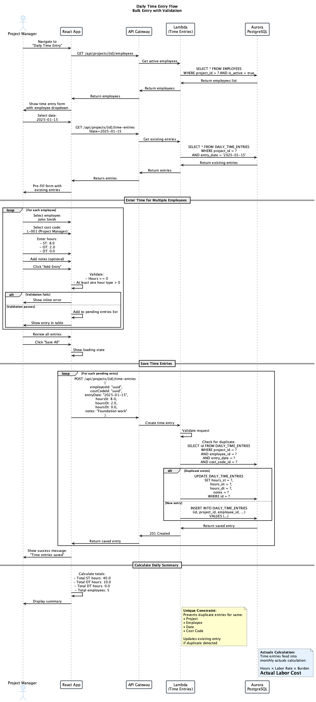

#### 4. Cost Calculation Pipeline

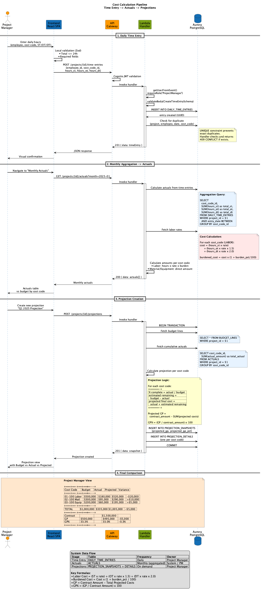

Complete cost calculation pipeline:

- Time Entry → Actuals → Projections (sequence flow)
- Labor cost formulas (ST/OT/DT × rate × burden)
- Projection logic (% complete, remaining cost, GP)
- Budget vs Actual vs Projected comparison view

#### 5. Project State Machine

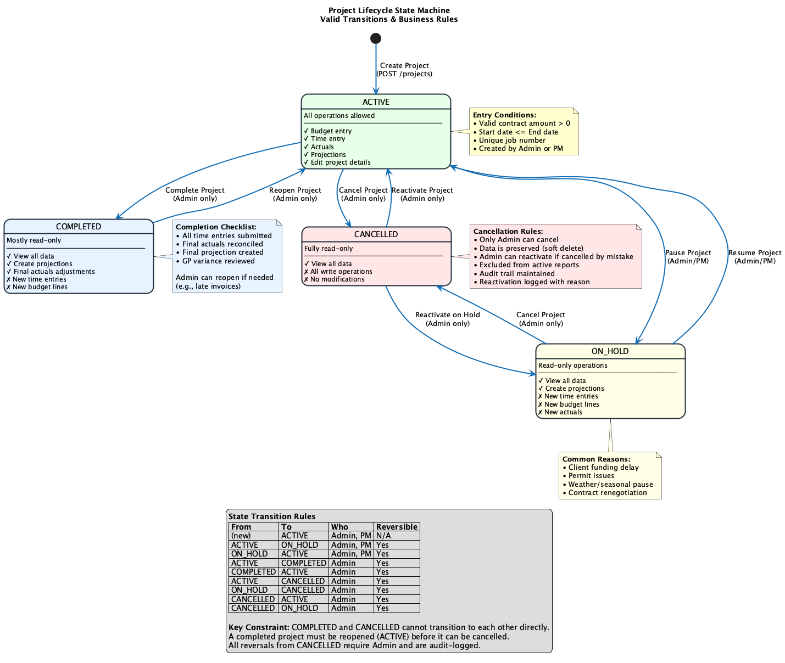

Project lifecycle state transitions:

- Valid state transitions (ACTIVE, ON_HOLD, COMPLETED, CANCELLED)
- Allowed operations per state
- Role permissions for each transition
- Business rules and constraints

#### 6. Budget Entry Workflow

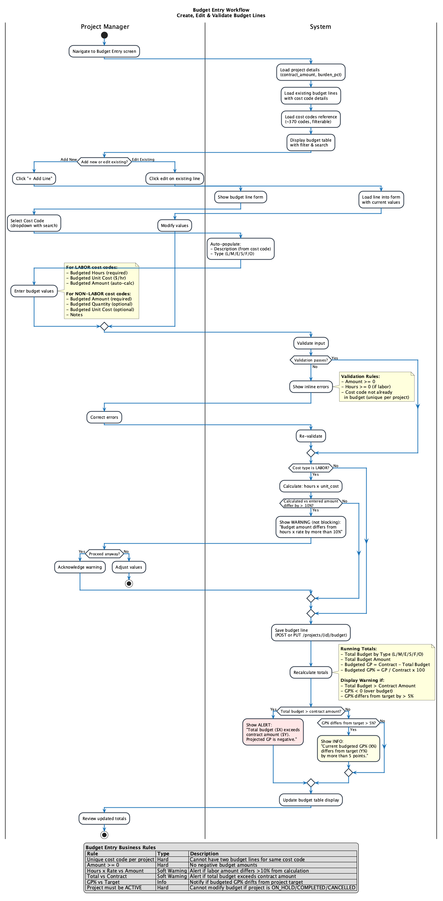

Budget entry activity diagram with all business rules:

- Add/edit budget line flow
- Labor vs non-labor field differences
- 10% variance warning (hours x rate vs amount)
- Running totals and GP% recalculation
- Over-budget and GP drift alerts
- Validation rules (hard blocks vs soft warnings)

Time tracking workflow:

- Employee selection
- Bulk time entry
- Validation
- Duplicate handling
- Summary calculation

### Deployment Diagrams

#### 1. Deployment Process

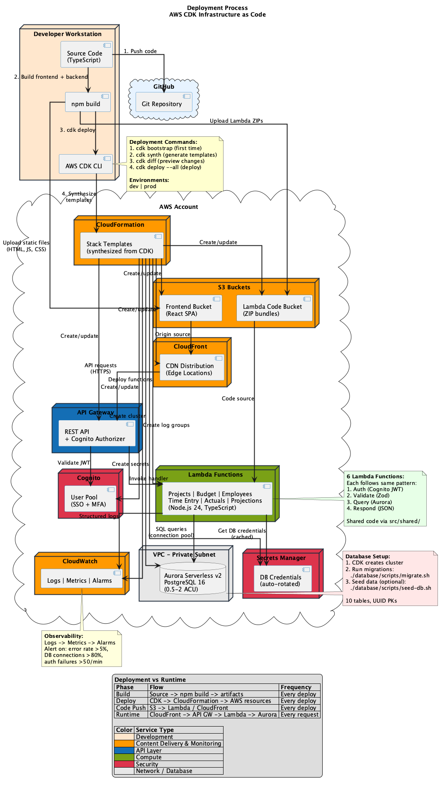

AWS CDK deployment:

- Development workflow
- CloudFormation stacks
- Resource creation
- Code deployment
- Runtime connections

## 🔄 Updating Diagrams

### Quick Update (Recommended)

Use the automated script to update all PNG images:

```bash
./scripts/update-diagrams.sh
```

This will:

1. Generate PNG images from all `.puml` files
2. Rename them to match the source files
3. Show a summary of changes

### Manual Update

If you prefer to update manually:

```bash
# Generate all PNGs
plantuml "docs/diagrams/**/*.puml"

# Or generate specific diagram
plantuml docs/diagrams/architecture/01-aws-infrastructure.puml
```

### Generate SVG (Scalable)

For higher quality, scalable images:

```bash
# Generate all SVGs
plantuml -tsvg "docs/diagrams/**/*.puml"

# Or specific diagram
plantuml -tsvg docs/diagrams/architecture/01-aws-infrastructure.puml
```

## 🛠️ Prerequisites

### Install PlantUML

**macOS:**

```bash
brew install plantuml
```

**Linux (Ubuntu/Debian):**

```bash
sudo apt-get install plantuml
```

**Windows:**

```bash
choco install plantuml
```

### VS Code Extension

For live preview while editing:

1. Install "PlantUML" extension
2. Open any `.puml` file
3. Press `Alt+D` to preview
4. Press `Ctrl+Shift+P` → "PlantUML: Export Current Diagram"

## 📝 Best Practices

When creating or modifying diagrams, follow these guidelines:

1. **Use the standard color scheme:**
   - `#FF9900` - Orange (Content Delivery, Monitoring)
   - `#146EB4` - Blue (API, Database)
   - `#7AA116` - Green (Compute, Lambda)
   - `#DD344C` - Red (Security Services)
   - `#232F3E` - Dark (Text, Borders)

2. **Keep diagrams focused:**
   - One diagram = One concept
   - Maximum 15-20 elements per diagram
   - Split complex diagrams into multiple files

3. **Add descriptive elements:**
   - Clear titles with subtitles
   - Informative notes
   - Comprehensive legends
   - Numbered flow steps

4. **Test before committing:**

   ```bash
   plantuml docs/diagrams/your-diagram.puml
   # Verify the PNG renders correctly
   ```

5. **Follow naming conventions:**
   - Use numbered prefixes: `01-`, `02-`, etc.
   - Use kebab-case: `my-diagram.puml`
   - Match PNG names to PUML names

## 📚 Additional Resources

- [PlantUML Official Documentation](https://plantuml.com/)
- [PlantUML Cheat Sheet](https://plantuml.com/guide)
- [Best Practices Guide](DIAGRAM_BEST_PRACTICES.md)
- [Validation Report](VALIDATION_REPORT.md)

## 🔍 Viewing Diagrams

### In VS Code

1. Install PlantUML extension
2. Open `.puml` file
3. Press `Alt+D` for preview

### Online

1. Visit https://www.plantuml.com/plantuml/uml/
2. Copy/paste diagram code
3. View rendered diagram

### In Documentation

All diagrams are automatically rendered as PNG images and can be viewed directly in this README or other markdown files.

## 🚀 Quick Commands

```bash
# Update all diagrams
./scripts/update-diagrams.sh

# Generate PNGs only
plantuml "docs/diagrams/**/*.puml"

# Generate SVGs only
plantuml -tsvg "docs/diagrams/**/*.puml"

# Generate both PNG and SVG
plantuml "docs/diagrams/**/*.puml"
plantuml -tsvg "docs/diagrams/**/*.puml"

# Check PlantUML version
plantuml -version

# Test specific diagram
plantuml docs/diagrams/architecture/01-aws-infrastructure.puml
```

## 📊 Diagram Statistics

- Total diagrams: 15
- Architecture: 6
- Data Model: 2
- Flows: 6
- Deployment: 1

## 🤝 Contributing

When adding new diagrams:

1. Create `.puml` file in appropriate directory
2. Follow naming convention: `##-descriptive-name.puml`
3. Use standard color scheme and styling
4. Add descriptive title and notes
5. Test rendering: `plantuml your-diagram.puml`
6. Run update script: `./scripts/update-diagrams.sh`
7. Update this README with new diagram
8. Commit both `.puml` and `.png` files

## 📝 Maintenance

Diagrams should be updated when:

- Architecture changes
- New features are added
- Database schema evolves
- Deployment process changes
- User flows are modified

Always regenerate PNG images after modifying `.puml` files!
