# UI Wireframes

PlantUML Salt wireframes for all MVP screens. Each screen is a separate `.puml` file.

## Authentication

### 01 — Login

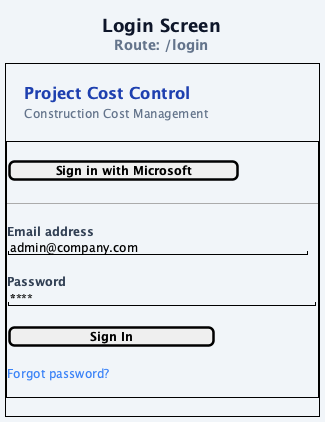

### 01b — MFA Verification

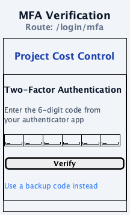

### 01c — New Password


## Project Screens

### 02 — Project Selection

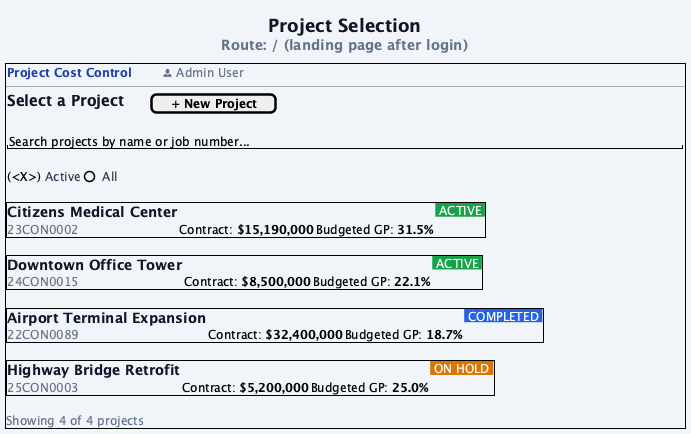

### 03 — Dashboard

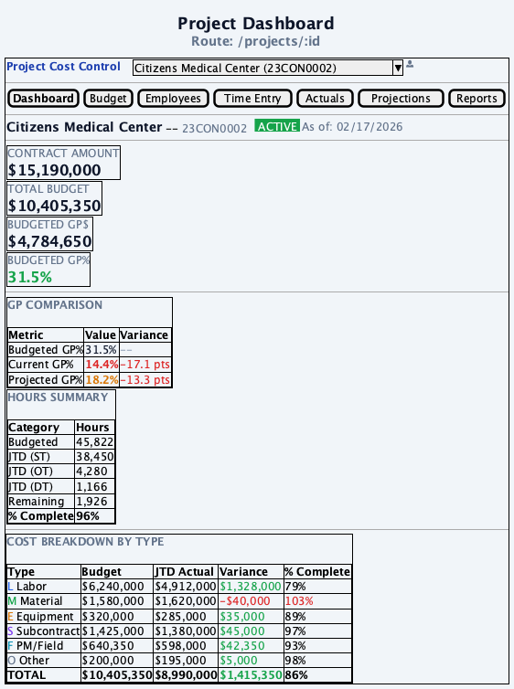

### 04 — Budget Entry

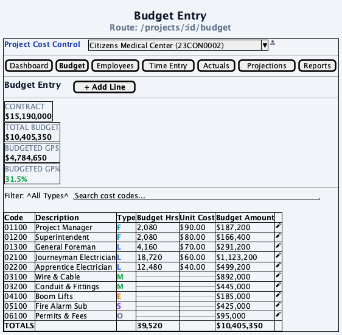

### 04b — Budget Line Modal

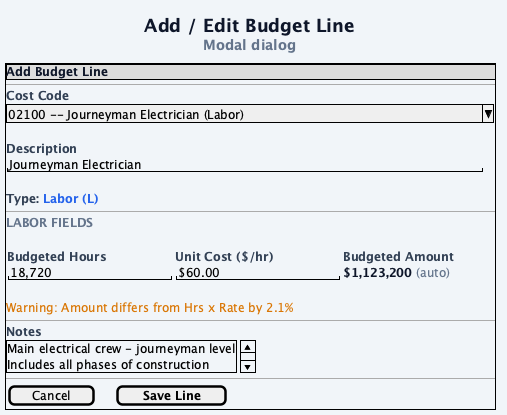

### 05 — Employee Roster

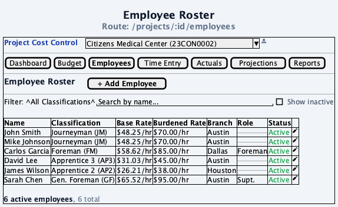

### 05b — Employee Modal

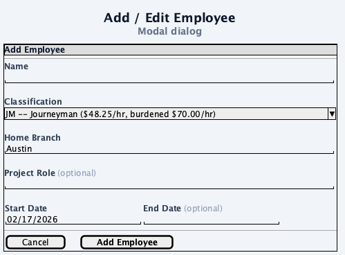

### 06 — Daily Time Entry

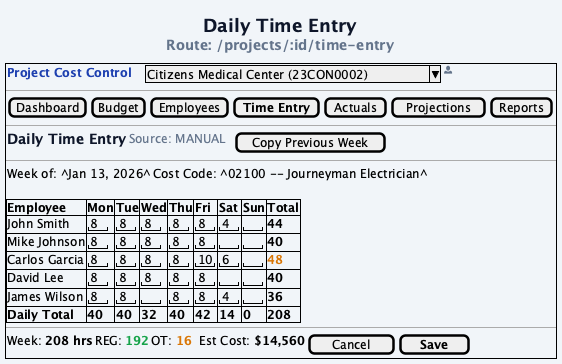

### 07 — Monthly Actuals

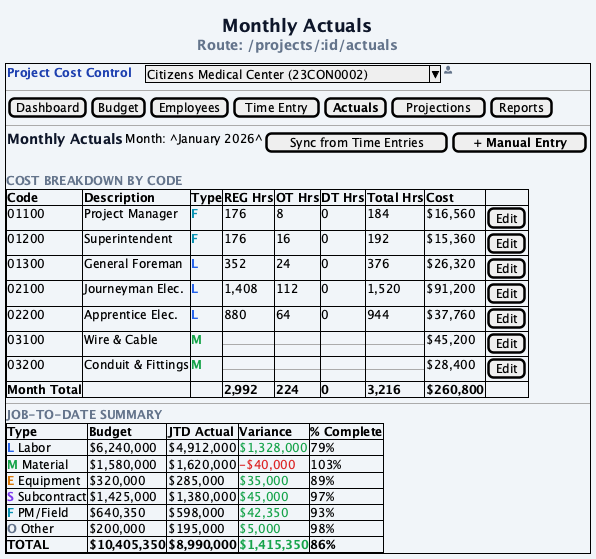

### 08 — Projections

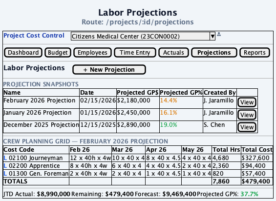

### 09 — Reports

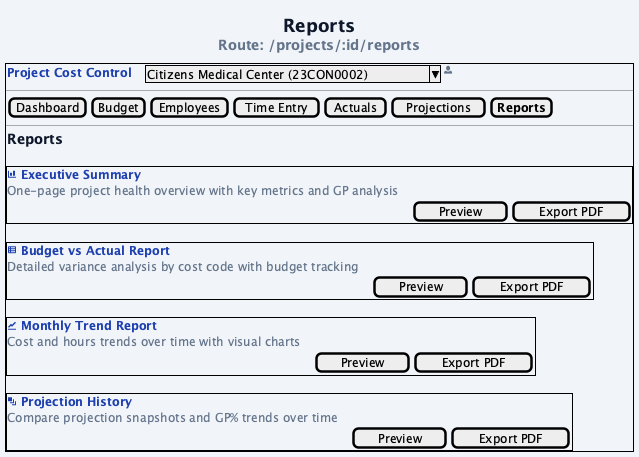

## Setup / Admin Screens

### 10 — Cost Codes

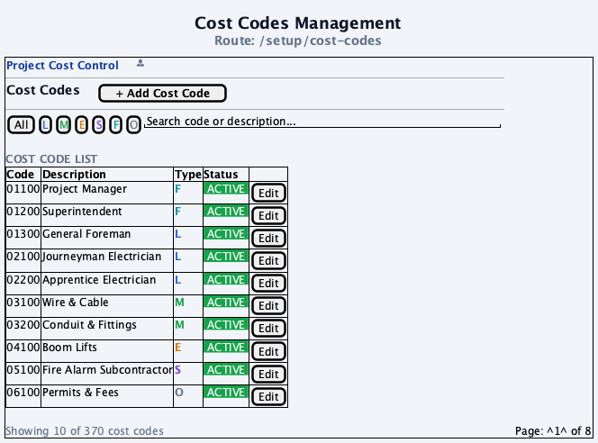

### 11 — Labor Rates

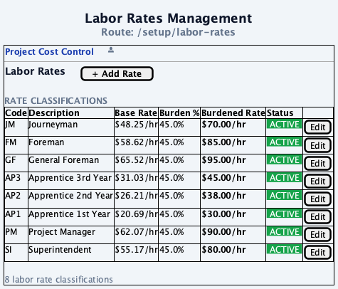

### 12 — Equipment Catalog

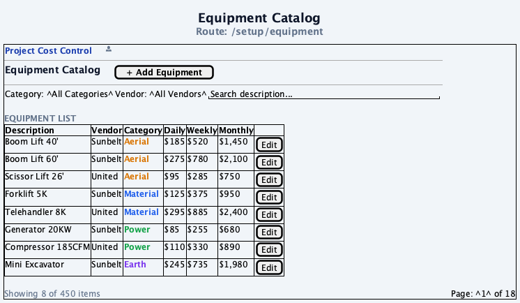

### 13 — User Management

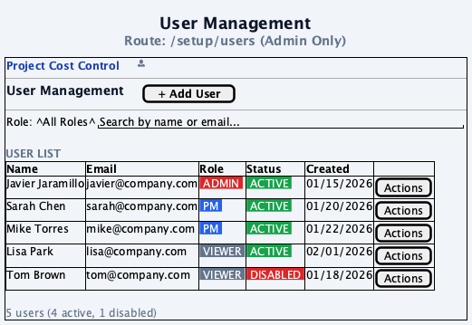

## Generating PNGs

```bash
# Generate all wireframes
for f in docs/diagrams/wireframes/*.puml; do
  plantuml "$f"
done
```
